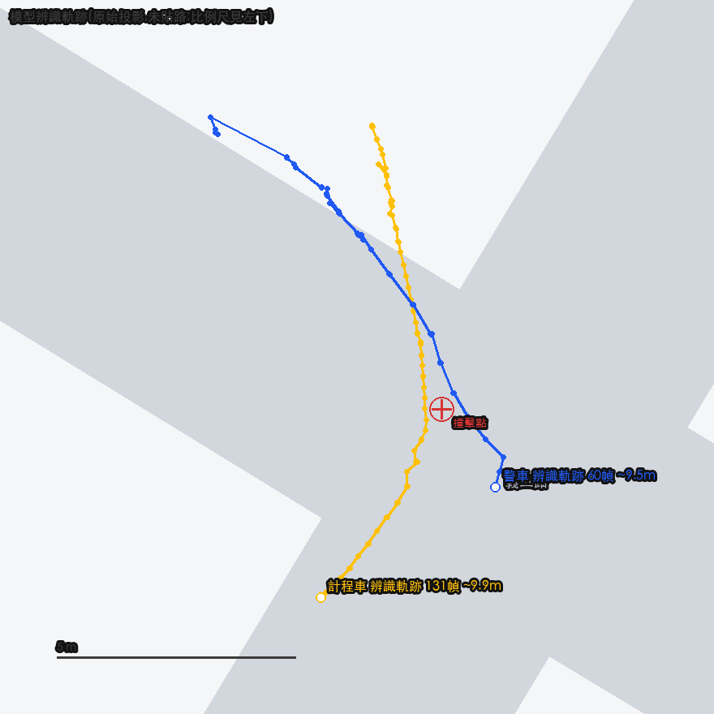
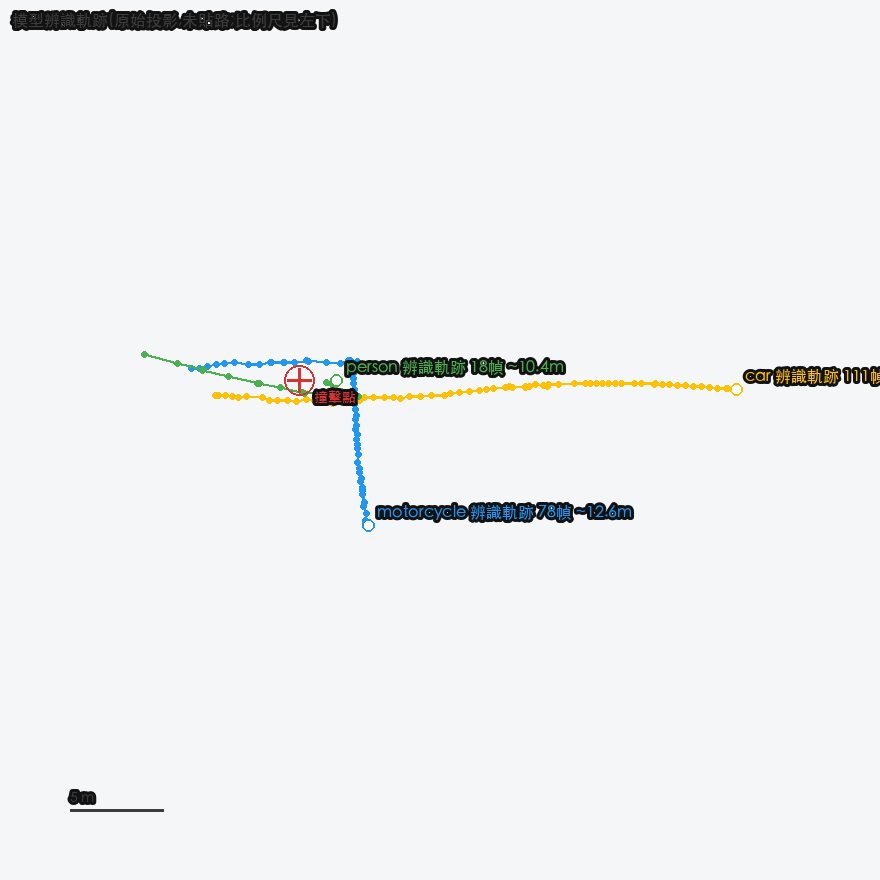
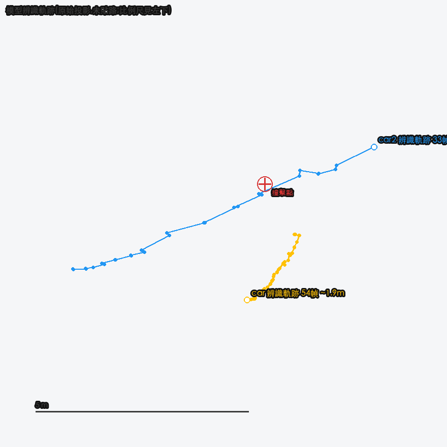
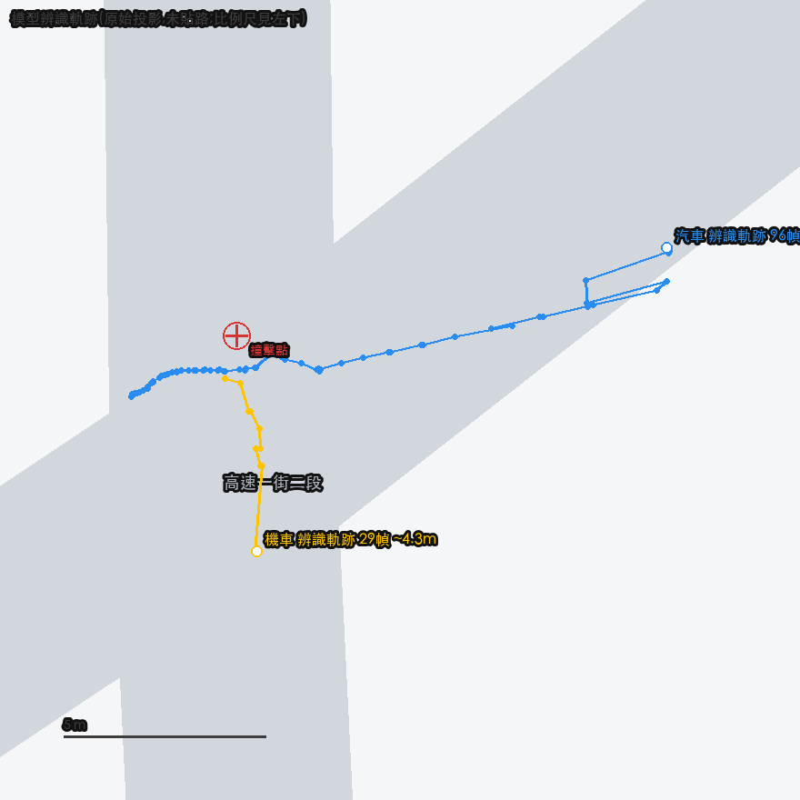
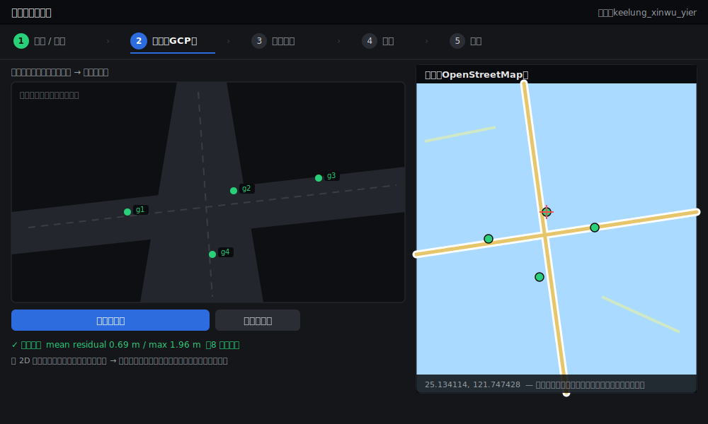

# 車禍事故 2D 重建

從監視器 / 行車記錄器影片，自動重建車禍車輛的二維行車軌跡，輸出 **KML**（可疊在 Google My Maps）、
**CSV**（每幀經緯度與速度）與**北向地圖圖片**，供事故分析與法鑑使用。

> 本專案原為 Roboflow `supervision` library 的 fork，現已改建為獨立的事故重建工具；
> 全部核心程式碼位於 [`accident_reconstruction/`](accident_reconstruction/)。

---

## 核心流程

```
影片 → ① 場景設定 → ② GCP 校正（像素↔經緯度單應矩陣）
      → ③ 框選車輛 → ④ SAM2 追蹤 → ⑤ 投影 + 撞擊偵測 + 道路對齊
      → ⑥ 輸出 KML / CSV / 地圖圖片
```

詳細架構、每一步說明與所有參數，見 [`docs/`](docs/) 文件：

- [`docs/README.md`](docs/README.md) — 完整使用說明
- [`docs/PROJECT_SUMMARY.md`](docs/PROJECT_SUMMARY.md) — 專案進度與操作紀錄
- [`docs/ACCIDENT_2D_RECONSTRUCTION.md`](docs/ACCIDENT_2D_RECONSTRUCTION.md) — 永康場景的技術細節

---

## 實際成果

四個場景的重建輸出如下。圖為**抽象軌跡圖（不含任何事故畫面）**：彩色線為各車的辨識軌跡、
🔴 為撞擊點，標註含速度與經緯度。每幀經緯度／速度另有 CSV、軌跡另有可疊 Google My Maps 的
KML（皆在 `data/`，不入庫）。各場景的來源、校正方法與殘差見 [`docs/DATA.md`](docs/DATA.md)。

> 來源為公開 YouTube 車禍影片，**僅列連結、影片不入庫**（檔大且有版權）。

<table>
  <tr>
    <td width="50%" valign="top">
      <br/>
      <b>基隆 信五路 × 義二路</b>（警車 × 計程車）· 辨識軌跡＋比例尺<br/>
      殘差 mean <b>0.69 m</b> · <a href="https://m.youtube.com/watch?v=REwQUfTaDMc&ra=m">來源影片</a>
    </td>
    <td width="50%" valign="top">
      <br/>
      <b>宜蘭五結 無號誌路口</b>（小貨車 × 機車 × 行人）· 辨識軌跡＋比例尺<br/>
      殘差 mean <b>0.69 m</b> · <a href="https://m.youtube.com/watch?v=7xQGDASAMEg">來源影片</a>
    </td>
  </tr>
  <tr>
    <td width="50%" valign="top">
      <br/>
      <b>桃園楊梅 高鐵南路七段</b>（違規左轉）· 辨識軌跡＋比例尺<br/>
      殘差 mean <b>0.43 m</b>（最準）· <a href="https://m.youtube.com/watch?v=naWS5Jhd6Yk">來源影片</a>
    </td>
    <td width="50%" valign="top">
      <br/>
      <b>台南永康 自強路 × 高速一街二段</b>（汽車 × 機車）· 辨識軌跡＋比例尺<br/>
      殘差 mean <b>3.20 m</b>（魚眼廣角）· <a href="https://m.youtube.com/watch?v=x_u9wGClKLQ">來源影片</a>
    </td>
  </tr>
</table>

## 介面：Web 工作台

把整條 pipeline 收進一個五步驟工作台（`accident_reconstruction.web_app`）：
**① 影片／下載 → ② 校正（GCP）→ ③ 標記車輛 → ④ 執行 → ⑤ 結果**。
下圖為步驟②校正畫面——左側點影片像素、右側在 OpenStreetMap 點對應經緯度，配對 ≥8 點即可
存檔並算出單應矩陣（示意圖，不含事故畫面）：



---

## 快速開始

```bash
# 安裝相依
uv sync                 # 或 pip install -e .

# 啟動 Web 工作台（整合所有步驟）
.venv/bin/python -m accident_reconstruction.web_app
# 開啟 http://127.0.0.1:8000

# 或用命令列跑完整 pipeline
ACCIDENT_SCENE=keelung_xinwu_yier \
    .venv/bin/python -m accident_reconstruction.run_pipeline
```

> `sam2.1_t.pt`（SAM2 Tiny 權重）由 ultralytics 於**首次執行時自動下載**，不需手動準備、也不入庫。
> YouTube 下載功能需要 `ffmpeg`。

---

## 給協作者：環境設定

```bash
# 1) 安裝相依（uv 會依 uv.lock + .python-version 建出一致環境）
uv sync

# 2) 啟用 pre-commit（commit 前自動跑 ruff / codespell）
uv run pre-commit install

# 3) 取得資料：影片與 data/ 不入庫，依 docs/DATA.md 自行下載重建
#    （內含每個場景的來源網址、下載指令、校正結果）
```

**環境注意事項**

- **Python 版本**：以 `.python-version`（3.13）為準，`uv sync` 會自動對齊，毋須手動裝 Python。
- **不入庫的東西**：`data/`（影片/輸出，大且有版權）、`.venv/`、`*.pt`（自動下載）。clone 後 `data/`
    會是空的 → 先讀 [`docs/DATA.md`](docs/DATA.md) 把資料重建出來再跑。
- **OpenCV GUI**：本專案裝 `opencv-python`（含 GUI）。**走 Web 工作台不需要 GUI**；只有部分舊的
    原生視窗工具（手動標註/校正視窗）才需要桌面環境，headless 機器（CI/遠端）請改用 Web 工作台。
    若你的環境同時被其他套件帶進 `opencv-python-headless` 會衝突，擇一安裝即可。

---

## 專案結構

```
accident_reconstruction/   可 import 的核心 pipeline 套件（純程式碼，見 docs/README.md）
docs/                      文件（使用說明、進度、技術細節、DATA.md 資料清單）
data/                      影片來源 + 各場景校正/追蹤/輸出（本地，不入庫）
pyproject.toml             套件與工具設定
uv.lock / .python-version  鎖定的依賴與 Python 版本（協作可重現）
sam2.1_t.pt                SAM2 追蹤權重（自動下載，不入庫）
```

---

## 授權

MIT License，見 [LICENSE.md](LICENSE.md)。
