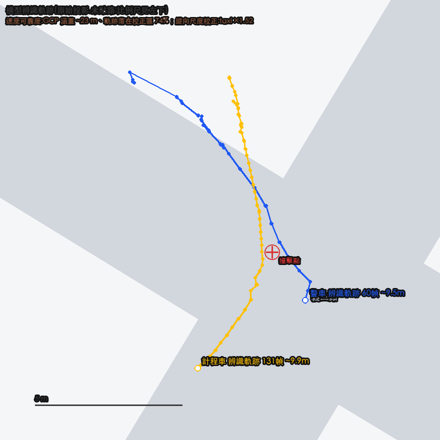
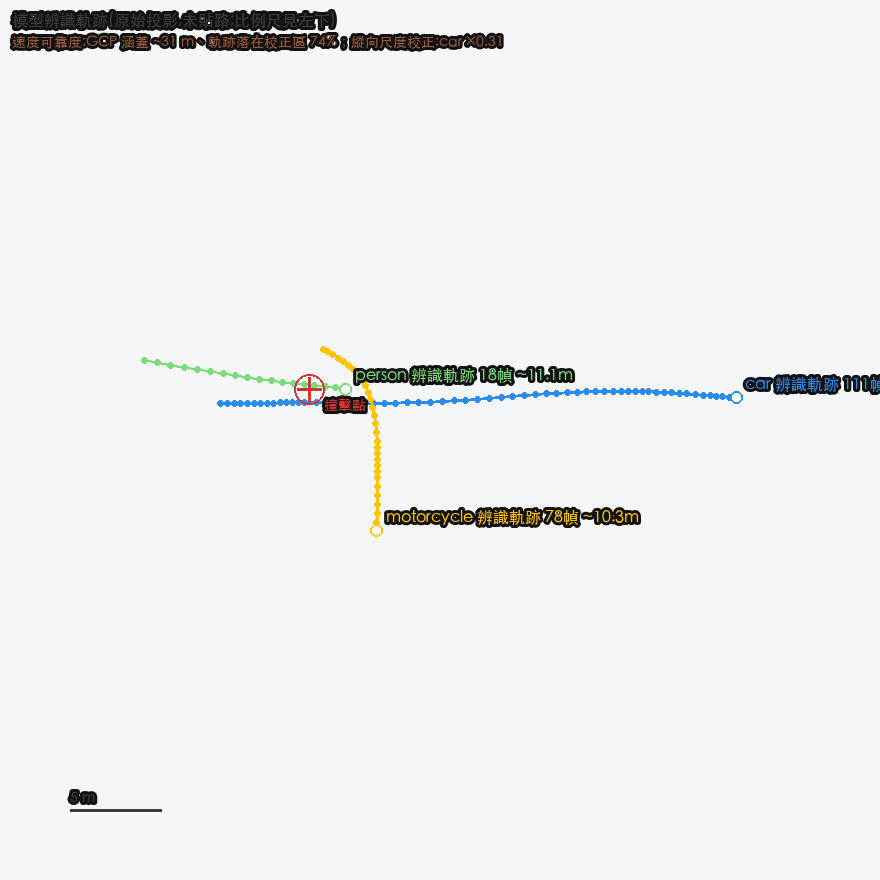
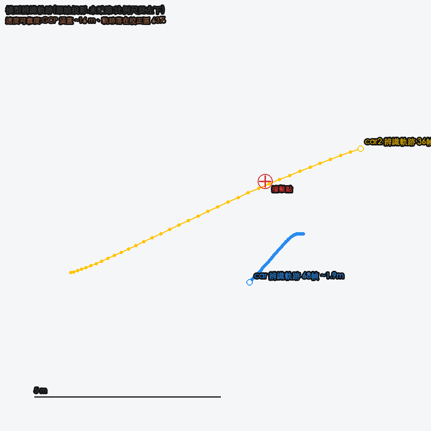
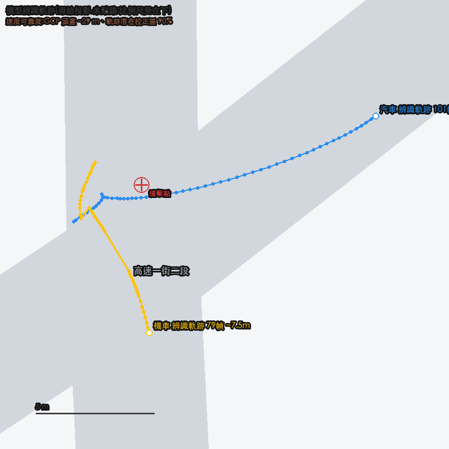
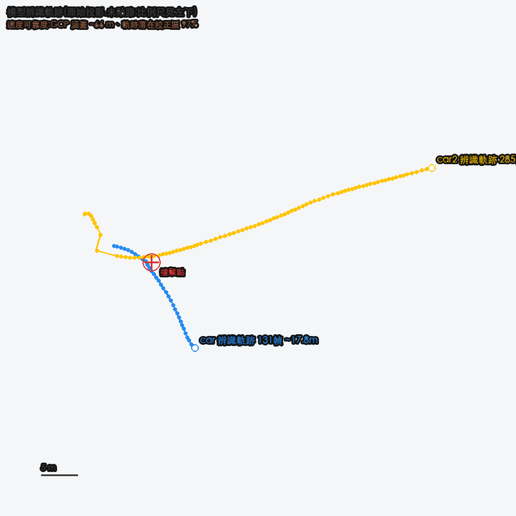
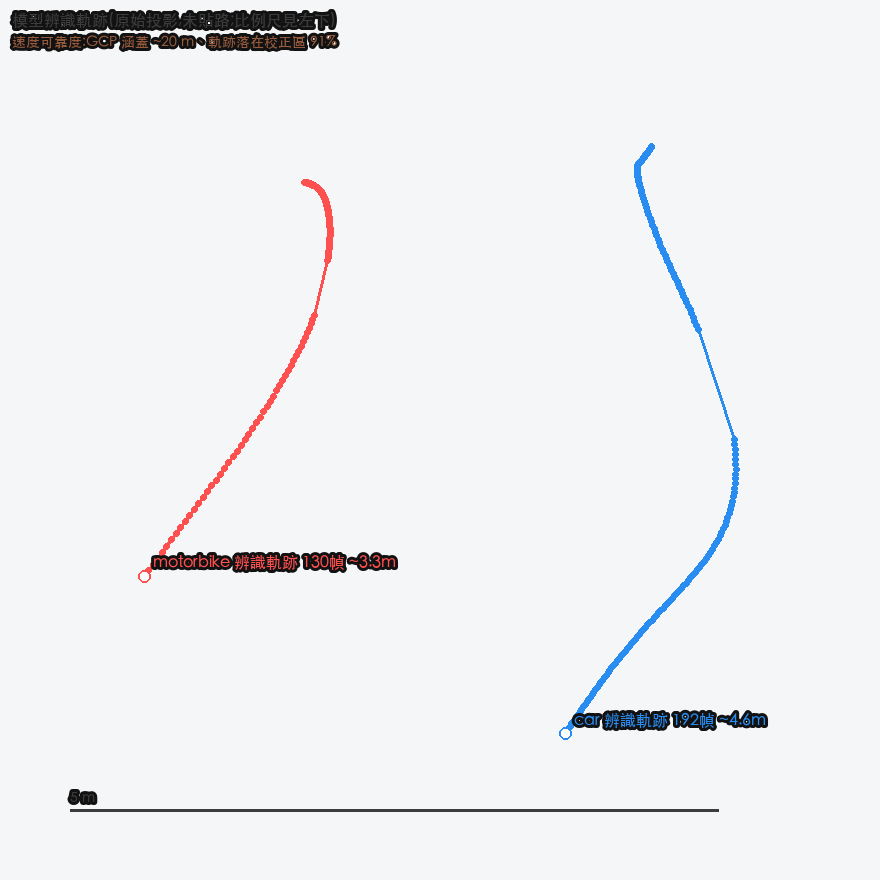
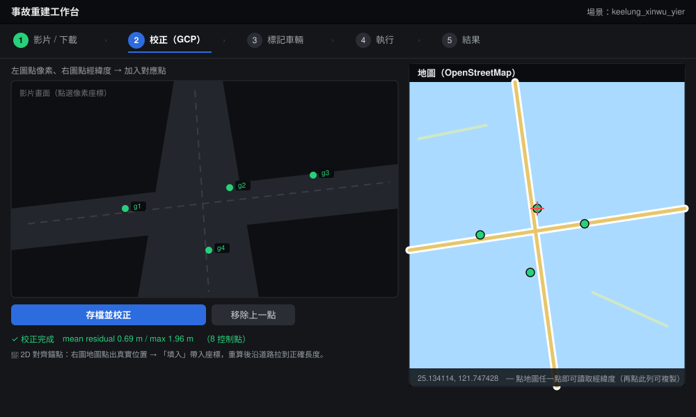

# 車禍事故 2D 重建

從監視器 / 行車記錄器影片，自動重建車禍車輛的二維行車軌跡，輸出 **KML**（可疊在 Google My Maps）、
**CSV**（每幀經緯度與速度）與**北向地圖圖片**，供事故分析與法鑑使用。

> 本專案原為 Roboflow `supervision` library 的 fork，現已改建為獨立的事故重建工具；
> 全部核心程式碼位於 [`accident_reconstruction/`](accident_reconstruction/)。

---

## 核心流程

```
影片 → ① 場景設定 → ② GCP 校正（像素↔經緯度單應矩陣）
      → ③ 框選車輛 → ④ SAM2 追蹤 → ⑤ 投影 + 撞擊偵測 + 軌跡精修 + 道路對齊
      → ⑥ 輸出 KML / CSV / 地圖圖片
```

其中步驟 ⑤ 的軌跡精修本身是一條子管線，順序為
**在地輪廓 anchor → 峰值速度守門 → Kalman-RTS 平滑 → 空缺補值 → 再平滑**；
平滑是**無條件**執行的最後一段，不隨 anchor 修正成功與否而被跳過
（見 [`docs/TRAJECTORY_SMOOTHING.md`](docs/TRAJECTORY_SMOOTHING.md)）。

速度與位置以這條 2D homography 管線為準；其餘（3D 場景、前端）都是圍繞它的呈現。

---

## 系統組成（各部分一覽）

本 repo 是「一條 2D 管線 + 圍繞它的呈現層」。各部分與其詳細文件：

| 部分                   | 做什麼                                                                             | 程式                                                                    | 詳細文件                                                                                                  |
| ---------------------- | ---------------------------------------------------------------------------------- | ----------------------------------------------------------------------- | --------------------------------------------------------------------------------------------------------- |
| **2D 重建管線**        | 影片 → 追蹤 → 投影 → 撞擊/對齊 → KML/CSV/圖                                        | `accident_reconstruction/`                                              | [`docs/README.md`](docs/README.md)、[`ACCIDENT_2D_RECONSTRUCTION.md`](docs/ACCIDENT_2D_RECONSTRUCTION.md) |
| **Web 工作台**         | 五步驟 UI 收整條管線，磁碟讀結果                                                   | `web_app.py`                                                            | [`docs/README.md`](docs/README.md) §工作台                                                                |
| **軌跡精修**           | 在地輪廓 anchor → 峰值守門 → Kalman-RTS 平滑 → 空缺補值 → 再平滑、Stage-2 疊加影片 | `ground_footprint.py`、`trajectory_smoothing.py`、`auto_reconstruct.py` | [`docs/summary.md`](docs/summary.md)、[`TRAJECTORY_SMOOTHING.md`](docs/TRAJECTORY_SMOOTHING.md)           |
| **車速校正**（Path A） | 方向感知的縱向尺度校正（後視誠實棄權）                                             | `auto_reconstruct.py`                                                   | [`docs/summary.md`](docs/summary.md) §車速                                                                |
| **3D 場景重建**        | 深度 splat 背景 + CAD 路面模型                                                     | `depth_backdrop.py`、`self_calibration.py`※                             | [`docs/3D_RECONSTRUCTION.md`](docs/3D_RECONSTRUCTION.md)                                                  |
| **前端 3D 檢視器**     | Three.js/R3F 回放軌跡＋底圖（OSM/Google tiles/splat）                              | `frontend/`                                                             | [`frontend/README.md`](frontend/README.md)、[`SPLAT_NOTES.md`](frontend/SPLAT_NOTES.md)                   |
| **資料交換格式**       | `reconstruction.json` schema（給前端）                                             | —                                                                       | [`docs/frontend_api.md`](docs/frontend_api.md)                                                            |

※ CAD 線在未併入的 branch `accident-scene-cad-modeling-5aaa03` 上，見 3D 文件。

**其他文件**：[`DATA.md`](docs/DATA.md)（各場景來源/校正/殘差）、
[`PROJECT_SUMMARY.md`](docs/PROJECT_SUMMARY.md)（進度紀錄）、
[`HANDOFF.md`](docs/HANDOFF.md)（交接續作）、[`TECH_REVIEW.md`](docs/TECH_REVIEW.md)（技術審查）、
[`SCENE_NOTES.md`](frontend/SCENE_NOTES.md)（3D 底圖/Google tiles 踩雷）。

---

## 實際成果

六個場景的重建輸出如下。圖為**抽象軌跡圖（不含任何事故畫面）**：彩色線為各車的辨識軌跡、
⊕ 為撞擊點，圖頂標註該場景的**速度可靠度**（GCP 涵蓋範圍、軌跡落在校正區的比例）。
每幀經緯度／速度另有 CSV、軌跡另有可疊 Google My Maps 的 KML（皆在 `data/`，不入庫）。
前四個場景的來源、校正方法與殘差見 [`docs/DATA.md`](docs/DATA.md)。

> 來源為公開 YouTube 車禍影片，**僅列連結、影片不入庫**（檔大且有版權）。

**殘差看的是校正準度，不是速度準度。** 速度＝homography 量得的距離／時間，只有在 GCP
真實涵蓋整段行車路線時才可靠；GCP 擠在小範圍時殘差會很漂亮，車速卻被嚴重低估
（下表因此並列 GCP 涵蓋範圍，詳見 [`docs/summary.md`](docs/summary.md)）。

<table>
  <tr>
    <td width="50%" valign="top">
      <br/>
      <b>基隆 信五路 × 義二路</b>（警車 × 計程車）<br/>
      殘差 mean <b>0.69 m</b> / max 1.96 m · GCP 涵蓋 ~23 m（8 點）<br/>
      <a href="https://m.youtube.com/watch?v=REwQUfTaDMc&ra=m">來源影片</a>
    </td>
    <td width="50%" valign="top">
      <br/>
      <b>宜蘭五結 無號誌路口</b>（小貨車 × 機車 × 行人）<br/>
      殘差 mean <b>0.69 m</b> / max 1.76 m · GCP 涵蓋 ~31 m（8 點）<br/>
      <a href="https://m.youtube.com/watch?v=7xQGDASAMEg">來源影片</a>
    </td>
  </tr>
  <tr>
    <td width="50%" valign="top">
      <br/>
      <b>桃園楊梅 高鐵南路七段</b>（違規左轉）<br/>
      殘差 mean <b>0.43 m</b> / max 0.77 m · GCP 涵蓋 ~16 m（10 點，範圍偏小）<br/>
      <a href="https://m.youtube.com/watch?v=naWS5Jhd6Yk">來源影片</a>
    </td>
    <td width="50%" valign="top">
      <br/>
      <b>台南永康 自強路 × 高速一街二段</b>（汽車 × 機車）<br/>
      殘差 mean <b>2.98 m</b> / max 6.63 m（魚眼廣角，殘差最大）· GCP 涵蓋 ~29 m（15 點）<br/>
      <a href="https://m.youtube.com/watch?v=x_u9wGClKLQ">來源影片</a>
    </td>
  </tr>
  <tr>
    <td width="50%" valign="top">
      <br/>
      <b>宜蘭市 娃娃車 × 自小客車</b><br/>
      殘差 mean <b>0.95 m</b> / max 2.22 m · GCP 涵蓋 <b>~66 m</b>（13 點，涵蓋最廣，
      MAGSAC++ 12/13 內點＋去畸變 k1=-0.15）<br/>
      <a href="https://youtu.be/vWBe0TbZFNQ">來源影片</a>
    </td>
    <td width="50%" valign="top">
      <br/>
      <b>臺北市大安區 基隆路四段</b>（BMW「神之鬼切」，汽車 × 機車）<br/>
      殘差 mean <b>0.33 m</b> / max 0.67 m · GCP 涵蓋 <b>僅 ~20 m</b>（15 點）——
      殘差最小但涵蓋最窄，<b>車速應偏低估</b>，此場景以軌跡形狀為主要參考<br/>
      本場景另有 3D 重建，見 <a href="docs/3D_RECONSTRUCTION.md">docs/3D_RECONSTRUCTION.md</a>
    </td>
  </tr>
</table>

## 介面：Web 工作台

把整條 pipeline 收進一個五步驟工作台（`accident_reconstruction.web_app`）：
**① 影片／下載 → ② 校正（GCP）→ ③ 標記車輛 → ④ 執行 → ⑤ 結果**。
下圖為步驟②校正畫面——左側點影片像素、右側在 OpenStreetMap 點對應經緯度，配對 ≥8 點即可
存檔並算出單應矩陣（示意圖，不含事故畫面）：



---

## 快速開始

```bash
# 安裝相依
uv sync                 # 或 pip install -e .

# 啟動 Web 工作台（整合所有步驟）
.venv/bin/python -m accident_reconstruction.web_app
# 開啟 http://127.0.0.1:8000

# 或用命令列跑完整 pipeline
ACCIDENT_SCENE=keelung_xinwu_yier \
    .venv/bin/python -m accident_reconstruction.run_pipeline

# 前端 3D 檢視器（回放軌跡；先 npm run sync:scenes 帶入 data/ 的重建結果）
cd frontend && npm install && npm run dev   # http://localhost:5173
```

> `sam2.1_t.pt`（SAM2 Tiny 權重）由 ultralytics 於**首次執行時自動下載**，不需手動準備、也不入庫。
> YouTube 下載功能需要 `ffmpeg`。

---

## 給協作者：環境設定

```bash
# 1) 安裝相依（uv 會依 uv.lock + .python-version 建出一致環境）
uv sync

# 2) 啟用 pre-commit（commit 前自動跑 ruff / codespell）
uv run pre-commit install

# 3) 取得資料：影片與 data/ 不入庫，依 docs/DATA.md 自行下載重建
#    （內含每個場景的來源網址、下載指令、校正結果）
```

**環境注意事項**

- **Python 版本**：以 `.python-version`（3.13）為準，`uv sync` 會自動對齊，毋須手動裝 Python。
- **不入庫的東西**：`data/`（影片/輸出，大且有版權）、`.venv/`、`*.pt`（自動下載）。clone 後 `data/`
    會是空的 → 先讀 [`docs/DATA.md`](docs/DATA.md) 把資料重建出來再跑。
- **OpenCV GUI**：本專案裝 `opencv-python`（含 GUI）。**走 Web 工作台不需要 GUI**；只有部分舊的
    原生視窗工具（手動標註/校正視窗）才需要桌面環境，headless 機器（CI/遠端）請改用 Web 工作台。
    若你的環境同時被其他套件帶進 `opencv-python-headless` 會衝突，擇一安裝即可。

---

## 專案結構

```
accident_reconstruction/   可 import 的核心 pipeline 套件（2D 重建 + 軌跡精修 + 3D splat 背景）
  ├ prompt_track_accident.py   Stage 1：SAM2 追蹤 → anchors + 接地輪廓
  ├ auto_reconstruct.py        Stage 2：投影 + 撞擊 + 軌跡精修編排 + 疊加影片
  ├ ground_footprint.py        在地輪廓 anchor / 空缺補值
  ├ trajectory_smoothing.py    等加速 Kalman + RTS 平滑、jerk 驗收指標
  ├ depth_backdrop.py          3D 深度 splat 背景（線 A）
  └ web_app.py                 Web 工作台（FastAPI）
frontend/                  Three.js/R3F 3D 檢視器（回放軌跡；SPLAT_NOTES.md / SCENE_NOTES.md）
docs/                      文件（使用說明、進度、2D/3D 技術細節、summary.md、DATA.md）
data/                      影片來源 + 各場景校正/追蹤/輸出/3D 產物（本地，不入庫）
pyproject.toml             套件與工具設定
uv.lock / .python-version  鎖定的依賴與 Python 版本（協作可重現）
sam2.1_t.pt                SAM2 追蹤權重（自動下載，不入庫）
```

> CAD 路面模型（線 B：`self_calibration.py`、`frontend/src/scene/RoadCad.tsx`）在未併入的
> branch `accident-scene-cad-modeling-5aaa03` 上——見 [`docs/3D_RECONSTRUCTION.md`](docs/3D_RECONSTRUCTION.md)。

---

## 授權

MIT License，見 [LICENSE.md](LICENSE.md)。
