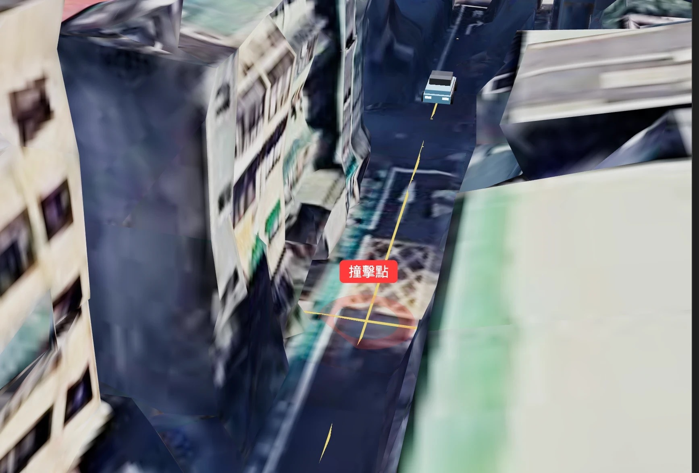
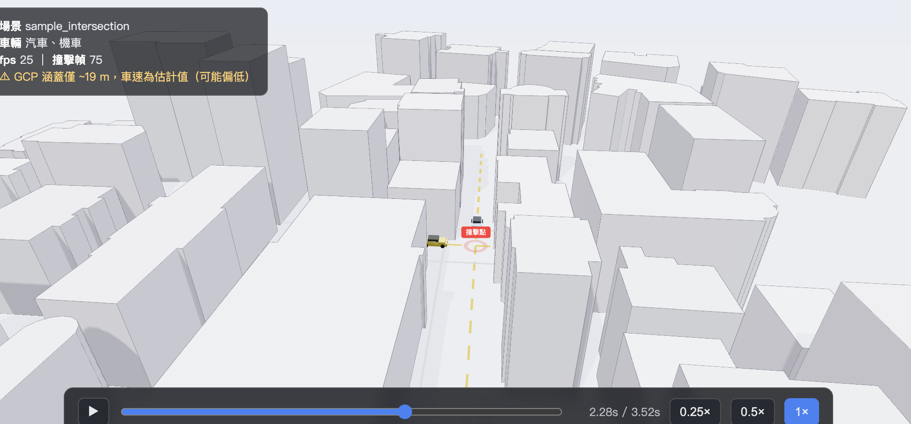

# 3D 場景與 Google Photorealistic 3D Tiles — 修正紀錄與陷阱

本文件記錄把車禍重建疊到 **Google 實景 3D Tiles**（台北實景）上時踩到的雷與對應修法。
對應程式：[`src/scene/Scene.tsx`](src/scene/Scene.tsx)、[`src/scene/GoogleTiles.tsx`](src/scene/GoogleTiles.tsx)、
[`src/scene/Ground.tsx`](src/scene/Ground.tsx)、[`src/App.tsx`](src/App.tsx)。

> TL;DR：底圖預設用**乾淨示意風**（OSM 建物擠出，`VITE_BASEMAP=schematic`）；也可切到
> **Google 實景圖磚**（`VITE_BASEMAP=tiles`）。兩者都把 `roads / vehicles / impact` 疊在
> 正確的街道位置；底圖載不進來會**優雅退回格線地面**，畫面永遠不黑屏、不讓 WebGL context 崩掉。

## 成果截圖



*修好 session token 後：重建內容（汽車、軌跡黃線、紅色「撞擊點」）正確疊在 Google 實景台北街景的真實街道上。*

---

## 從合成範例改成實際跑過的場景

原本前端固定載入 `public/reconstruction.sample.json`（虛構的 `sample_intersection`，
台北 25.0413/121.532，直線假軌跡）。現在改成載入 **pipeline 實際跑過的 6 個場景**：
`npm run sync:scenes` 把 `data/**/*_reconstruction.json` 複製進 `public/scenes/` 並產生
`index.json`，HUD 可切換、網址可用 `?scene=<id>` 指定。詳見
[`README.md`](README.md#%E5%A0%B4%E6%99%AF%E8%B3%87%E6%96%99%E5%AF%A6%E9%9A%9B%E8%B7%91%E9%81%8E%E7%9A%84%E8%B7%AF%E7%B7%9A)。

換成真實資料後暴露出幾個原本被合成範例掩蓋的問題，一併修掉：

| 問題                                      | 原因                                                                                                           | 修法                                                                                                                                                |
| ----------------------------------------- | -------------------------------------------------------------------------------------------------------------- | --------------------------------------------------------------------------------------------------------------------------------------------------- |
| **柏油路面完全看不到**，只剩白色路緣線    | `ribbon()` 的三角形繞向讓法線朝**下**，從上往下看全被 backface culling 剃掉（打光也是黑的）                    | [`ribbon.ts`](src/scene/ribbon.ts) 改成 `left → next-left → right`，法線 +Y                                                                         |
| 車禍變成畫面中一個小點                    | 相機／霧／陰影全是為 60 m 合成範例寫死的（150 m 俯視、霧 150→360、陰影 120 m）；真實場景只有 5–30 m            | [`bounds.ts`](src/scene/bounds.ts) 由**軌跡**算出場景半徑，所有距離都從它導出                                                                       |
| 用 `roads` 一起算範圍會再放大 20 倍       | `roads` 是整條街的中心線（基隆 ±100 m），不是事故範圍                                                          | `computeBounds` 只看 `vehicles` + `impact`                                                                                                          |
| 4 / 6 場景**完全沒有街道**                | 那些場景的 `roads` 是 `{}`，而 Overpass 只抓了 `building`                                                      | [`osm.ts`](src/scene/osm.ts) 同時抓 `highway`，[`OsmStreets.tsx`](src/scene/OsmStreets.tsx) 用真實寬度（`width` / `lanes`）畫；抓不到才退回 `roads` |
| 開場前幾秒空街，看起來像壞掉              | 時鐘從 0 開始，但軌跡可能從第 120 幀（4.1 s）才有                                                              | `App.tsx` 起始時間設成最早的 `trackStart`                                                                                                           |
| **看不到跑出來的路線本身**                | 只有車在動，走過的軌跡沒畫出來                                                                                 | [`TrackPath.tsx`](src/scene/TrackPath.tsx)：完整路線淡色 + 已行駛段實色，端點跟著車走                                                               |
| 機車／行人都畫成 4.4 m 房車               | `CarModel` 只有一種車                                                                                          | [`vehicleKind.ts`](src/scene/vehicleKind.ts) 依 id/名稱分類，機車與行人各有模型                                                                     |
| **離線時整個畫面全黑**                    | `<Environment preset="city">` 從 CDN 抓 HDRI，失敗會炸掉整個 `<Canvas>`（`Context Lost` 迴圈、Scene 每幀重掛） | [`SafeEnvironment.tsx`](src/scene/SafeEnvironment.tsx)：預設用純解析光，`VITE_HDRI=city` 才啟用 HDRI                                                |
| Overpass 每次重載都重抓、建物顏色每次不同 | 無快取；顏色用 `Math.random()`                                                                                 | `sessionStorage` 依 (lat, lon, radius) 快取；顏色改用 OSM way id 的雜湊                                                                             |

## 場景組成

- `App.tsx` 建立 `<Canvas>`（`far: 5_000_000` 容納 ECEF 尺度、`logarithmicDepthBuffer`、ACES tone mapping）。
- `Scene.tsx` 放光源、`GoogleTiles`、內容群組（`Roads` / `Vehicle` / `ImpactMarker` / `ContactShadows`）、`OrbitControls`。
- `GoogleTiles.tsx` 用 `3d-tiles-renderer/r3f` 載 Google 圖磚；`ReorientationPlugin` 把 `origin_latlon`
    那個 GPS 點重新置於本地原點（up = +Y），所以公尺座標的重建內容**不需要額外轉換**就落在實景上。
- 所有 ML/pipeline 之外的座標都是「以 `origin_latlon` 為原點的公尺」：`x = x_m`、`z = -z_m`、`y` 向上。

---

## 底圖模式（`VITE_BASEMAP`）

兩種底圖，用環境變數切換：

| 值                      | 底圖                                                                 | 特性                                                 |
| ----------------------- | -------------------------------------------------------------------- | ---------------------------------------------------- |
| `schematic`（**預設**） | [`CityBlocks.tsx`](src/scene/CityBlocks.tsx)：OSM 建物輪廓擠出       | **乾淨銳利、可自由環繞、無扭曲**；示意風（非實景）   |
| `tiles`                 | [`GoogleTiles.tsx`](src/scene/GoogleTiles.tsx)：Google 實景 3D Tiles | 實景照片級，但近景會融化／扭曲、路面烙印車輛（見下） |

**為何預設改成示意風**：Google 實景是空照攝影測量，街道近景天生「歪七扭八」且無法移除烙印
車輛——那是資料/方法上限，非 bug。示意風用 OSM 真實建物輪廓 + 真實樓高擠出，邊緣銳利、可
自由環繞，最適合事故重建的「清楚好讀」。

`CityBlocks` 重點：

- 從 **Overpass API** 抓 `origin_latlon` 周圍 `radius` 內的 `building` way（與 `highway` 同一個
    請求，見 [`osm.ts`](src/scene/osm.ts)；`radius` 由 [`bounds.ts`](src/scene/bounds.ts) 依場景大小算，
    夾在 140–250 m）。
- 用本地等距投影把經緯度轉成場景公尺（與重建同框：`x = east`、`z = -north`），
    `THREE.ExtrudeGeometry` 擠出樓高（`height` tag → `building:levels`×3.2 → 預設 12 m），
    `rotateX(-90°)` 讓擠出方向朝上，最後 `mergeBufferGeometries` 併成一個 mesh（省 draw call）。
- **每棟各自 try/catch**：OSM 偶有自相交/退化多邊形會讓 `ExtrudeGeometry` 丟例外；
    不可讓一棟壞掉整批失敗（之前就是這樣全黑）。
- Overpass 抓不到（離線/限流）→ 不畫建物，仍保留格線地面，不會壞。

### OSM 顯示區域（範圍與投影）

- **中心**：`origin_latlon`（重建檔的場景原點）。範例 `sample_intersection` = `25.0413, 121.532`
    → 台北市大安區忠孝東路三段路口。
- **抓取範圍**：Overpass `(around:${radius},lat,lon)`，`radius` = `framingFor(bounds.radius).osmRadius`
    = `clamp(場景半徑×5, 140, 250)` m。建物與道路共用同一次請求，並依 (lat, lon, radius)
    存進 `sessionStorage`，重載/切回場景不再重打 Overpass。
- **投影**：本地等距投影（以原點為切平面）
    `east = (lon − lon0)·111320·cos(lat0)`、`north = (lat − lat0)·111320`，
    場景座標 `x = east`、`z = −north` → 與重建（道路 / 車輛 / 撞擊點）**同框對齊**，不需額外轉換。
- **可視 vs 抓取**：抓取半徑是脈絡；實際入鏡範圍由相機開場角度與 `fog` 收成「車禍場景大小」，
    兩者都從 `bounds.radius` 導出（`fog` = 半徑×4 → ×11）。
- **改顯示區域**：調 [`bounds.ts`](src/scene/bounds.ts) 的 `osmRadius`。越大脈絡越多、越吃 Overpass
    流量；基隆路口 140 m 半徑約 11 棟 + 13 條路，250 m 則是 27 棟 + 29 條路。
- **離線/快取注意**：每次載入即時打 Overpass（`https://overpass-api.de/api/interpreter`）。
    公用端點會限流；要穩定可改鏡像或自建快取（目前失敗會優雅退回格線地面）。

**示意風的乾淨外觀**（[`CityBlocks.tsx`](src/scene/CityBlocks.tsx) + [`SchematicStreets.tsx`](src/scene/SchematicStreets.tsx)）：

- **建物**：每棟給微幅冷灰色階變化（vertex color）＋ `EdgesGeometry` 深色描邊 → CAD/Horizon 的銳利感。
- **街道**：淺色路面 + **OSM 真實道路**（[`OsmStreets.tsx`](src/scene/OsmStreets.tsx)，寬度取自
    `width` / `lanes` tag）擠成柏油路帶，加**白色路緣線 + 黃色虛線車道線**（≥7 m 才畫中線）。
    Overpass 抓不到才退回 `data.roads` 中心線（[`SchematicStreets.tsx`](src/scene/SchematicStreets.tsx)）。
- **淺色日間主題**：`useSchematic` 時背景/霧用淺色 `#e9edf3`，遠處柔和淡出。
- **範圍貼合車禍場景**：相機、霧、陰影、地面大小全部由 `bounds.radius` 導出，換場景自動重新取景。

可調參數：[`bounds.ts`](src/scene/bounds.ts) 的 `framingFor()`（相機／霧／陰影／`osmRadius`）；
[`ribbon.ts`](src/scene/ribbon.ts) 的 `Y_*` 疊放高度；`osm.ts` 的 `roadWidth()` 預設寬度。

> 地面標示目前是合成的車道線（中心虛線 + 路緣線）。斑馬線／停止線資料我們沒有，可日後再合成。

> 想換成實景：`.env` 設 `VITE_BASEMAP=tiles`（需 `VITE_GOOGLE_TILES_KEY`）。

---

## 這次修掉的問題（依嚴重度）

### 1. 子圖磚少了 `session` token → 全部 4xx（**根因**）

- **症狀**：`root.json` 200，但每個子 `.glb / .json` 都 `?key=…`（沒有 `session=`）→ **400**，
    少數變 **403**，畫面只剩遠方粗糙圖磚或全黑。
- **驗證**：curl 同一個 child URL，帶 `session` → **200**，不帶 → **400**（`session` 在
    `root.json` 的 `content.uri` 裡，可被正確抽出）。問題是 renderer 在 session token 設好**之前**
    就送出第一批 key-only 請求。
- **修法**：給 `GoogleCloudAuthPlugin` 開 **`autoRefreshToken: true`**。遇到 4xx 它會重新抓
    session token 並帶 session 重送 → 200。
    ```ts
    args={[{ apiToken: GOOGLE_TILES_KEY, autoRefreshToken: true }]}
    ```
- **連帶**：開機瞬間仍有一小撮 key-only 的 4xx，以及 `glTF … is not valid JSON`
    （auth plugin 在 session 還沒設好時對 `.glb` 做 `res.json()`）。**皆為暫態、非致命**，
    session 進來後就停。

### 2. GroundProbe 回傳垃圾高度 → 整個場景被推到地底 56 km

- **症狀**：畫面什麼都沒有。實際上幾何都在，只是被推到 `y ≈ -56798`。
- **根因**：`GroundProbe` 對「半載入／粗糙」圖磚做向下 raycast，回傳了離譜的 `y`，
    而內容群組 `position={[0, groundY, 0]}` 跟著掉下去。
- **修法**（[`GoogleTiles.tsx`](src/scene/GoogleTiles.tsx)）：reorientation 後地表本來就在原點附近，
    因此**拒絕 `|y| > 1000` 的命中**；並在圖磚退場時把 `groundY` 重設為 0。

### 3. 載不進來的圖磚把 WebGL context 弄掉（崩潰迴圈）

- **症狀**：`THREE.WebGLRenderer: Context Lost` 連續洗版、canvas 被拆掉、HUD 還在但 3D 全黑。
- **根因**：圖磚一直 4xx，renderer 不停重試 churn。
- **修法**：`GoogleTiles` 用**時間窗**後備——12 秒內若沒有任何圖磚成功載入（`onLoadModel`
    沒觸發），就 `onUnavailable()`，`Scene` 收到後停掉 `GoogleTiles` 並保留格線地面。
    一旦有圖磚成功（`healthy`），就**永不**退場。
    > 注意：後備刻意用「時間」而非「錯誤次數」。開機那批 key-only 4xx 會瞬間累積到任何
    > 次數門檻，但 `autoRefreshToken` 的重試稍晚才成功——用次數會在重試成功前就誤殺圖磚。

### 4. 圖磚失敗時沒有後備畫面（黑屏）

- **修法**（[`Scene.tsx`](src/scene/Scene.tsx)）：背景色永遠畫（不再純黑 void）；
    只要圖磚還沒載入成功（`!tilesReady`）就顯示 [`Ground`](src/scene/Ground.tsx) 格線地面當底，
    圖磚一載入（`onLoaded`）就把格線藏起來。**重建內容因此永遠看得到。**

### 5. 開場運鏡盯著空氣

- 舊版開場把相機擺到原點正上方 220 m 直直往下；但原點街景圖磚串流慢，於是看到一片黑。
- **修法**：開場改成「~90 m 俯視 → 貼地三段式 smoothstep」，**全程把車禍框在畫面內**，
    並隨 `groundY` 一起移動。可調參數：`INTRO_SECONDS`、起訖高度（`90 → 16`）。

---

## 各狀態旗標（`Scene.tsx`）

| 狀態          | 意義                                                 | 由誰設定                                       |
| ------------- | ---------------------------------------------------- | ---------------------------------------------- |
| `groundY`     | 把內容群組／相機抬到實際街面高度                     | `GoogleTiles.onGround`（已 clamp \`            |
| `tilesReady`  | 圖磚已載入 → 隱藏格線地面                            | `GoogleTiles.onLoaded`（第一個 `onLoadModel`） |
| `tilesFailed` | 圖磚放棄 → 卸載 `GoogleTiles`、`groundY=0`、保留格線 | `GoogleTiles.onUnavailable`（12s 無成功）      |

---

## 清晰度與可視範圍（可調）

實景太模糊、地圖範圍太大時的調整鈕：

| 目的                                          | 參數                                | 位置                                                  | 預設       |
| --------------------------------------------- | ----------------------------------- | ----------------------------------------------------- | ---------- |
| **更清晰**（載入更細的圖磚）                  | `errorTarget`（越小越細／越吃流量） | `GoogleTiles.tsx` `<TilesRenderer errorTarget={6}>`   | 6          |
| 不讓 Google plugin 把 `errorTarget` 強制回 20 | `useRecommendedSettings: false`     | `GoogleTiles.tsx` auth plugin args                    | false      |
| **限制範圍**（遠處直接裁掉）                  | 相機 `far`                          | `App.tsx` `<Canvas camera={{ far: 2500 }}>`           | 2500 m     |
| 遠處柔化（淡入背景色、避免硬邊）              | `<fog>` near/far                    | `Scene.tsx`（`useTiles` 時 `["#10131a", 600, 1600]`） | 600→1600 m |

> 想更清晰可把 `errorTarget` 再降（如 4），代價是更多圖磚請求與流量；想看更廣就調大 `far`
> 與 fog 的 near/far。

**無法用程式解決的部分**（屬 Google 圖磚資料本身）：

- **路面上「烙印」的汽機車**：拍攝當下街上的車輛被烘進 photogrammetry 網格，是 Google 的資料、
    不是我們畫的，前端無法移除。
- **街道近景天生糊**：圖磚由空照／斜角影像重建，垂直牆面與街面解析度有上限；`errorTarget`
    只能載到「現有最細」的 LOD，到頂之後再低也不會更清楚。

---

## 環境與執行

- 需要 `frontend/.env` 內的 `VITE_GOOGLE_TILES_KEY`（Maps Platform **API key**，啟用 *Map Tiles API*、
    開帳單）。**沒有 key 時**自動走格線地面後備，仍可看重建。
- 啟動：
    ```bash
    cd frontend && npm install && npm run dev   # http://localhost:5173
    ```
- `reconstruction.json` 來源：預設 `public/scenes/index.json` 清單（`npm run sync:scenes` 產生），可用
    `VITE_RECONSTRUCTION_URL` 覆寫（見 [`README.md`](README.md)）。

---

## 仍待處理 / 已知小問題

- **開機暫態錯誤**：session 設好前的少量 4xx 與 `glTF … is not valid JSON`（auth plugin 在
    session 還沒設好時對二進位 `.glb` 做 `res.json()`）。非致命，session 進來後即停。
    > 試過「先 prefetch session 再 seed 進 auth plugin」想消掉這段噪音，但**會破壞 root 請求**：
    > Google 的 `root.json` **不接受** `session=`（回 400），seed 後連 root 都帶上 session →
    > root 載入失敗、整個 Canvas 崩潰。**已還原**。要徹底消除得改/fork `3d-tiles-renderer`
    > （讓子請求等 root 的 session 就緒才發），不值得為這點暫態噪音冒險。
- **格線地面 + `logarithmicDepthBuffer`**：drei `<Grid>` 在開了 log depth buffer 時格線會看不清，
    目前靠實心地面墊底；要更明顯的格線需另解。
- **方向光陰影**：`directionalLight` 的 shadow frustum 仍對著世界原點，場景被 `groundY` 抬高後
    投影陰影可能裁切（車底的 `ContactShadows` 不受影響）。
- **GCP 涵蓋小 → 車速偏低**：與本次 3D 無關，詳見 [`../docs/summary.md`](../docs/summary.md)。

osm/OpenStreetMap成果

